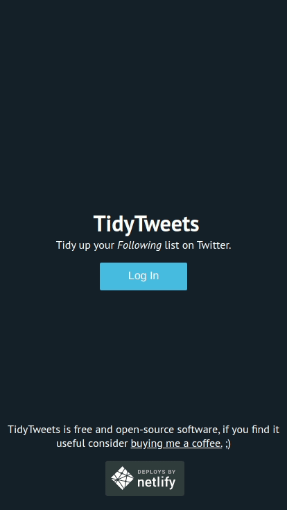

[](https://github.com/rlueder/tidytweets/blob/main/LICENSE)

# Tidy Tweets

> Tidy up your `Following` list on Twitter.

TidyTweets analyses your Following list on Twitter telling you which accounts haven't been active in a specific time frame (one week, two weeks, one month, three months, six months and a year). You can then unfollow individual accounts, a few selected accounts or all at once.

"Awesome! What else does it do?". Well, that's it! At least for now. :)



## Table of Contents

- [1. Getting Started](#1-getting-started)
  - [1.1 Prerequisites](#1.1-prerequisites)
  - [1.2 Installing](#1.2-installing)
  - [1.3 Running Locally](#1.3-running-locally)
- [2. Contributing](#2-contributing)
- [3. Testing](#3-testing)
- [4. Deployment](#4-deployment)
- [5. Built With](#5-built-with)
- [6. Credits and Community](#6-credits-and-community)
- [7. Donations](#7-donations)
- [8. License](#8-license)

## 1. Getting Started

These instructions will get you a copy of the project up and running on your local machine for development and testing purposes.

### 1.1 Prerequisites

You'll need Node installed on your machine, the best way to install/manage Node versions is to use NVM.

- [NVM](https://github.com/nvm-sh/nvm) - manage multiple node.js versions

### 1.2 Installing

```
$ yarn install
```

### 1.3 Running Locally

Requests sent directly to a Twitter API from a development environment will result in CORS errors, for that reason we use Netlify's functions to proxy API requests to Twitter.

**NOTE You'll have to be a part of TidyTweet's team on Netlify for the Twitter proxy function to authenticate on your local environment. Open a Github issue to request access to the team or join our Slack channel.**

To set up Netlify locally, run the following command:

```
$ ntl link
```

If you haven't logged into Netlify CLI yet (and assuming you already have a Netlify acct.) this will open a new browser window with the following message:

```
Netlify CLI is asking for permission to access Netlify on your behalf.
```

Click on `Authorize`; you'll then see a prompt on your terminal:

```
How do you want to link this folder to a site?
```

Choose `Enter a site ID` and paste TidyTweet's Netlify ID:

```
091de6ff-ebf8-455b-8e5b-db2571213ac1
```

You should then see a confirmation similar to the one below:

```
Directory Linked

Admin url: https://app.netlify.com/sites/tidytweets
Site url:  https://tidytweets.org

```

Now you can start the development server by running the command below:

```
$ yarn develop
```

The application will be available at [http://localhost:8888](http://localhost:8888)

You can read more about Netlify CLI, Netlify Functions and CORS here:

- [Netlify CLI](https://cli.netlify.com/)

- [Netlify Functions](https://docs.netlify.com/functions/overview/)

- [Solve CORS once and for all with Netlify Dev](https://alligator.io/nodejs/solve-cors-once-and-for-all-netlify-dev/)

## 2. Contributing

TidyTweets uses the Gitflow workflow branching model. To contribute features or bug fixes:

1. fork the repo;

2. create a new branch off the `development` branch with the name of your feature or bug fix (e.g. `fix_reload_issue` branch);

3. once you're finished with your changes send a pull request from your branch.

Once your PR is approved your changes will be merged into the `development` branch and Netlify will deploy your changes to the [development environment](https://development--tidytweets.netlify.app/).

You can read more about Gitflow and Netlify branch deploys here:

- [Netlify branches and deploys](https://docs.netlify.com/site-deploys/overview/#branches-and-deploys)

- [Gitflow Workflow](https://www.atlassian.com/git/tutorials/comparing-workflows/gitflow-workflow)

- [A successful Git branching model](https://nvie.com/posts/a-successful-git-branching-model/)

## 3. Testing

We use Flow for type-checking all code, to run flow locally, use the following command:

```
$ yarn flow
```

You can run a Flow coverage report with the following command (coverage is low at the moment, we're working on improving it):

```
$yarn flow-coverage
```

Unit and integration tests use Jest, you can run the interactive test monitor with the following command:

```
$ yarn test
```

End-to-end tests are setup on Cypress, you can run the application with the following command:

```
$ yarn cypress:open
```

You can read more about testing here:

- [CRA Running Tests](https://create-react-app.dev/docs/running-tests)

- [Write tests. Not too many. Mostly integration.](https://kentcdodds.com/blog/write-tests)

- [Static Type Checking](https://reactjs.org/docs/static-type-checking.html)

## 4. Deployment

TidyTweets uses CircleCI as a deployment tool, commits to `develop` or `main` branches trigger a build which runs all tests and deploys to prod in case of a commit to `main`.

You can read more about Netlify site deploys and SemVer here:

- [Netlify deploys](https://docs.netlify.com/site-deploys/overview/)

- [Semantic Versioning](https://semver.org/)

## 5. Built With

- [@fortawesome/react-fontawesome](https://github.com/FortAwesome/react-fontawesome) - Font Awesome 5 React component.

- [@reach/router](https://github.com/reach/router) - next Generation Routing for React.

- [create-react-app](https://github.com/facebook/create-react-app) - create React apps with no build configuration.

- [date-fns](https://github.com/date-fns/date-fns) - modern JavaScript date utility library.

- [netlify-cli](https://github.com/netlify/cli) - interact with Netlify from the comfort of your CLI.

- [react-copy-write](https://github.com/aweary/react-copy-write) - immutable state with a mutable API.

- [react-intl](https://formatjs.io/docs/react-intl) - internationalize your web apps on the client & server.

- [twitter-lite](https://github.com/draftbit/twitter-lite) - a tiny, full-featured, flexible client / server library for the Twitter API.

## 6. Credits and Community

This project exists thanks to all the <a href="https://github.com/rlueder/tidytweets/graphs/contributors">people who contribute</a>.

- [Rafael Lüder](https://github.com/rlueder)
- [Dominic Ilnicki](https://github.com/Ilnicki010)
- [Juan Colombo](https://github.com/juan-colombo95)

You can reach out to us directly by joining [TidyTweets on Slack.](https://join.slack.com/t/tidytweets/shared_invite/zt-fa0kmbu9-bPWUvBCnvDjgVWgxyJz7~w)

## 7. Donations

TidyTweets is free and open-source software, if you find it useful [consider buying me a coffee](https://www.buymeacoffee.com/rlueder). Thanks!

## 8. License

This project is licensed under the MIT License - see the [LICENSE](LICENSE) file for details.